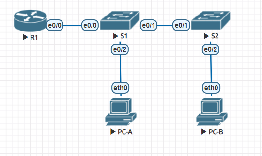
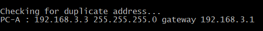
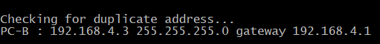
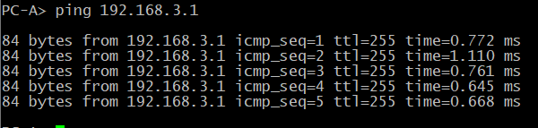
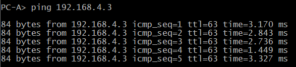
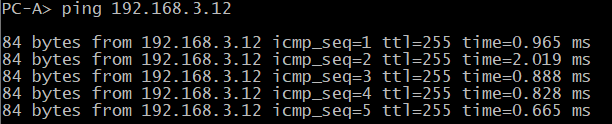
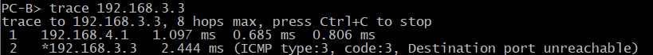

# Лабораторная работа. Внедрение маршрутизации между виртуальными локальными сетями

## Топология

## Таблица адресации

|Устройство | Интерфейс | IP-адрес         | Маска подсети  |   Шлюз по умолчанию   |
|-----------|-----------|------------------|----------------|-----------------------|
|R1         |E0/0.3     |192.168.3.1       | 255.255.255.0  |   -                   |
|           |E0/0.4     |192.168.4.1       | 255.255.255.0  |   -                   |
|           |E0/0.8     |--                | --             |   --                  |
|S1         |VLAN 3     |192.168.3.11      | 255.255.255.0  |   192.168.3.1         |
|S2         |VLAN 3     |192.168.3.12      | 255.255.255.0  |   192.168.3.1         |
|PC-A       |NIC        |192.168.3.3       | 255.255.255.0  |   192.168.3.1         |
|PC-B       |NIC        |192.168.4.3       | 255.255.255.0  |   192.168.4.1         |

## Таблица VLAN

|VLAN       | Имя       | Назначенный интерфейс         |
|-----------|-----------|------------------|
|3          |Management |S1: VLAN 3        |
|           |           |S2: VLAN 3        |
|           |           |S1: e0/2          |
|4          |Operations |S2: e0/2          |
|7          |Parking_lot|S1: e0/3, e1/1-32 |
|           |           |S2: e0/3          |
|8          |My_native_vlan     |--      |

### Задачи

    Часть 1. Создание сети и настройка основных параметров устройства
    Часть 2. Создание сетей VLAN и назначение портов коммутатора
    Часть 3. Настройка транка 802.1Q между коммутаторами.
    Часть 4. Настройка маршрутизации между сетями VLAN
    Часть 5. Проверка, что маршрутизация между VLAN работает

### Решение

*Файл CPT с полностью настроенным оборудованием [тут](hw_01.unl)*

#### Часть 1. Создание сети и настройка основных параметров устройств

##### Шаг 1. Создание сети согласно топологии

Подключил устройства, как показано в топологии, и подсоединил необходимые кабели.

##### Шаг 2. Настройка маршрутизатора

    a. Подключившись к маршрутизатору с помощью консоли активировал привилегированный режим EXEC.
    b. Перешел в режим конфигурации командой **conf t**.
    c. Отключил поиск DNS командой **no ip domain-lookup**.
    d. Командой **enable secret class** установил зашифрованный пароль привилегированного режима EXEC.
    e. Командами **line con 0 > password cisco > login** установил cisco в качестве пароля консоли и включил вход в систему по паролю.
    f. Используя команды **line vty 0 4 > passord cisco > login ** назначил пароль VTY и включил вход в систему по паролю.
    g. Включил шифрование открытых паролей **service password-encryption**.
    h. Установил имя маршрутизатора **hostname R1** 
    i. Сохранил текущую конфигурацию в файл загрузочной конфигурации:
        R1# copy run startup-config
    j. Настроил время 

##### Шаг 3. Настроил базовые параметры каждого коммутатора

    a. Присвоил коммутаторам имя **hostname S1** и **hostname S2** 
    b. Отключил поиск DNS командой **no ip domain-lookup**
    c. Командой **enable secret class** установил зашифрованный пароль привилегированного режима EXEC.
    d. Командами **line con 0 > password cisco > login** установил cisco в качестве пароля консоли и включил вход в систему по паролю.
    e. Используя команды **line vty 0 4 > passord cisco > login ** назначил пароль VTY и включил вход в систему по паролю.
    f. Включил шифрование открытых паролей **service password-encryption**.
    g. Настроил на коммутаторах время.
    h. Сохранил текущую конфигурацию в качестве стартовой командой **copy run start**.

##### Шаг 4. Настроил компьютеры

Настройки сетевой карты компьютера PC-A

Настройки сетевой карты компьютера PC-B

#### Часть 2. Создание сетей VLAN и назначение портов коммутатора

##### Шаг 1. Создание сети VLAN на коммутаторах

Настройку этого задания привожу на основе коммутатора **S1**.
a. Создание и именование необходимых VLAN на каждом коммутаторе. Данные взял из таблицы:

    S1(config)#vlan 3
    S1(config-vlan)#name MGMNT
    S1(config-vlan)#vlan 4
    S1(config-vlan)#name Operations
    S1(config-vlan)#vlan 7
    S1(config-vlan)#name Parking_Lot
    S1(config-vlan)#vlan 8
    S1(config-vlan)#name my_native_vlan
    S1(config-vlan)#exit

b. Настройка интерфейса управления и шлюза по умолчанию:

    S1(config)#int vlan 3
    S1(config-if)#ip address 192.168.3.11 255.255.255.0
    S1(config-if)#no shutdown
    S1(config-if)#exit
    S1(config)#ip default-gateway 192.168.3.1

c. Назначил все неиспользуемые порты коммутатора VLAN Parking_Lot, настроил их для статического режима доступа и административно деактивировал их.
Очень пригодилась команда **interface range**.

    S1(config)#int range e0/3, e1/1-3
    S1(config-if-range)#sw mode ac
    S1(config-if-range)#sw acc vl 7
    S1(config-if-range)#shutdown
    S1(config-if-range)#exit

##### Шаг 2. Назначение сети VLAN соответствующим интерфейсам коммутатора

a. Назначил используемым портам соответствующий VLAN и настроил их для режима статического доступа.

    S1(config)#int e0/2
    S1(config-if)#sw mo ac
    S1(config-if)#sw ac vl 3

b. Убедился, что VLAN назначены на правильные интерфейсы.

    S1#sh vl brief

    VLAN Name                             Status    Ports
    ---- -------------------------------- --------- -------------------------------
    1    default                          active
    3    Management                       active    Et0/2
    4    Operations                       active
    7    ParkingLot                       active    Et0/3, Et1/0, Et1/1, Et1/2
                                                    Et1/3
    8    my_native_vlan                   active
    1002 fddi-default                     act/unsup
    1003 token-ring-default               act/unsup
    1004 fddinet-default                  act/unsup
    1005 trnet-default                    act/unsup

#### Часть 3.Конфигурация магистрального канала стандарта 802.1Q между коммутаторами

##### Шаг 1. Вручную настроил магистральный интерфейс e0/1 на коммутаторах S1 и S2

a. Настройка статического транкинга на интерфейсе e0/1 для обоих коммутаторов.

    S1(config)#int e0/1
    S1(config-if)#switchport trunk encapsulation dot1q
    S1(config-if)#sw mode trunk

b. Установил native VLAN 8 на обоих коммутаторах.

    S1(config-if)#sw tr native vlan 8

Отловил ошибку о том, что между двумя интерфейсами установлены разные native VLAN.

c. Указал, что VLAN 3, 4, 8 могут проходить по транку.

    S1(config-if)#sw tr all vlan 3,4,8

d. Проверил транки, native VLAN и разрешенные VLAN через транк.

S1#show interfaces trunk

    Port        Mode             Encapsulation  Status        Native vlan
    Et0/1       on               802.1q         trunking      8

    Port        Vlans allowed on trunk
    Et0/1       3-4,8

    Port        Vlans allowed and active in management domain
    Et0/1       3-4,8

    Port        Vlans in spanning tree forwarding state and not pruned
    Et0/1       3-4,8

##### Шаг 2. Ручная настройка магистрального интерфейса e0/0 на коммутаторе S1

a. Настроил интерфейс S1 e0/0 с теми же параметрами транка, что и e0/1. Это транк до маршрутизатора.

    S1(config)#int f0/5
    S1(config-if)#switchport trunk encapsulation dot1q
    S1(config-if)#sw mode trunk
    S1(config-if)#sw tr native vlan 8
    S1(config-if)#sw tr all vlan 3,4,8

b. Сохранил текущую конфигурацию в файл загрузочной конфигурации.

c. Проверка транкинга.

   S1#show interfaces trunk

    Port        Mode             Encapsulation  Status        Native vlan
    Et0/0       on               802.1q         trunking      8
    Et0/1       on               802.1q         trunking      8

    Port        Vlans allowed on trunk
    Et0/0       3-4,8
    Et0/1       3-4,8

    Port        Vlans allowed and active in management domain
    Et0/0       3-4,8
    Et0/1       3-4,8

    Port        Vlans in spanning tree forwarding state and not pruned
    Et0/0       3-4,8
    Et0/1       3-4,8

#### Часть 4. Настройка Маршрутизации между сетями VLAN

##### Шаг 1. Настройка маршрутизатора

a. Аактивировал интерфейс e0/0 на маршрутизаторе.
b. Настроил подинтерфейсы для каждой VLAN, как указано в таблице IP-адресации. Все подинтерфейсы используют инкапсуляцию 802.1Q. При настройке включил описание для каждого подинтерфейса.

    R1(config)#int e0/0.3
    R1(config-subif)#encapsulation dot1q 3
    R1(config-subif)#ip addr 192.168.3.1 255.255.255.0
    R1(config-subif)#int e0/0.4
    R1(config-subif)#encapsulation dot1q 4
    R1(config-subif)#ip addr 192.168.4.1 255.255.255.0
    R1(config-subif)#int e0/0.8
    R1(config-subif)#encapsulation dot1Q 8 native 

Убедился, что подинтерфейсу для native VLAN не назначен IP-адрес.
На подинтерфейсе **VLAN 3** есть адрес:

    R1#show interface e0/0.3
    Ethernet0/0.3 is up, line protocol is up
        Hardware is AmdP2, address is aabb.cc00.1000 (bia aabb.cc00.1000)
        Internet address is 192.168.3.1/24
        MTU 1500 bytes, BW 10000 Kbit/sec, DLY 1000 usec,
            reliability 255/255, txload 1/255, rxload 1/255
        Encapsulation 802.1Q Virtual LAN, Vlan ID  3.
        ARP type: ARPA, ARP Timeout 04:00:00
        Keepalive set (10 sec)
        Last clearing of "show interface" counters never

На **native VLAN** нет:

    R1#show interface e0/0.8
    Ethernet0/0.8 is up, line protocol is up
        Hardware is AmdP2, address is aabb.cc00.1000 (bia aabb.cc00.1000)
        MTU 1500 bytes, BW 10000 Kbit/sec, DLY 1000 usec,
            reliability 255/255, txload 1/255, rxload 1/255
        Encapsulation 802.1Q Virtual LAN, Vlan ID  8.
        ARP type: ARPA, ARP Timeout 04:00:00
        Keepalive set (10 sec)
        Last clearing of "show interface" counters never

c. Используя команду **show ip interface brief** проверил, что все подинтерфейсы работают.

    R1#sh ip interface brief
    Interface                  IP-Address      OK? Method Status                Protocol
    Ethernet0/0                unassigned      YES NVRAM  up                    up
    Ethernet0/0.3              192.168.3.1     YES NVRAM  up                    up
    Ethernet0/0.4              192.168.4.1     YES NVRAM  up                    up
    Ethernet0/0.8              unassigned      YES unset  up                    up
    Ethernet0/1                unassigned      YES NVRAM  administratively down down
    Ethernet0/2                unassigned      YES NVRAM  administratively down down
    Ethernet0/3                unassigned      YES NVRAM  administratively down down

Убедился, что вспомогательные интерфейсы работают. Проверил маршрутизацию:

    R1#sh ip route
    Codes: L - local, C - connected, S - static, R - RIP, M - mobile, B - BGP
        D - EIGRP, EX - EIGRP external, O - OSPF, IA - OSPF inter area
        N1 - OSPF NSSA external type 1, N2 - OSPF NSSA external type 2
        E1 - OSPF external type 1, E2 - OSPF external type 2
        i - IS-IS, su - IS-IS summary, L1 - IS-IS level-1, L2 - IS-IS level-2
        ia - IS-IS inter area, * - candidate default, U - per-user static route
        o - ODR, P - periodic downloaded static route, H - NHRP, l - LISP
        + - replicated route, % - next hop override

    Gateway of last resort is not set

        192.168.3.0/24 is variably subnetted, 2 subnets, 2 masks
    C        192.168.3.0/24 is directly connected, Ethernet0/0.3
    L        192.168.3.1/32 is directly connected, Ethernet0/0.3
        192.168.4.0/24 is variably subnetted, 2 subnets, 2 masks
    C        192.168.4.0/24 is directly connected, Ethernet0/0.4
    L        192.168.4.1/32 is directly connected, Ethernet0/0.4

#### Часть 5. Проверка работы маршрутизации между VLAN

##### Шаг 1. Выполнил тесты с PC-A

a. Отправил эхо-запрос с PC-A на шлюз по умолчанию.

b. Отправил эхо-запрос с PC-A на PC-B.

c. Отправил команду ping с компьютера PC-A на коммутатор S2.

##### Шаг 2. Выполнил тест с PC-B

В окне командной строки на PC-B выполните команду tracert на адрес PC-A.

**Вопрос:** Какие промежуточные IP-адреса отображаются в результатах?

    Видим, что в результате отобразился адрес шлюза для сети компьютера PC-B и конечный узел - компьютер PC-A
