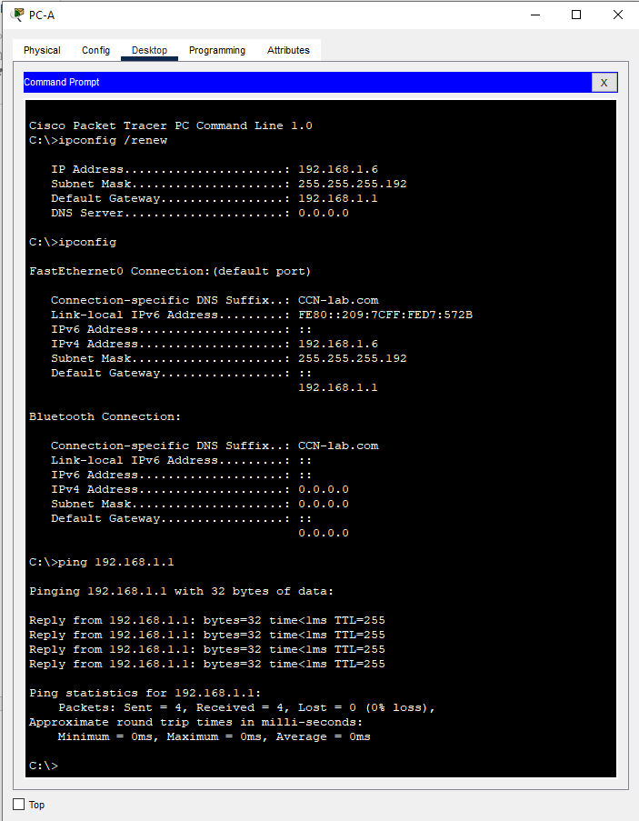
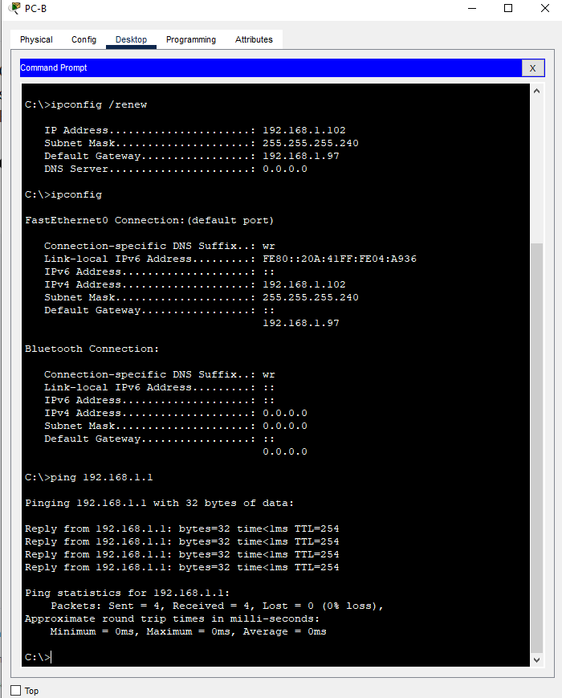

# Lab - Implement DHCPv4

## Topology

## Initial addressing table

|  Device   | Interface | IP Address     | Subnet Mask    | Default Gateway |
|-----------|-----------|----------------|----------------|-----------------|
|R1         |G0/0/0     |10.0.0.1        | 255.255.255.252|        N/A      |
|           |G0/0/1     |       N/A      |        N/A     |        N/A      |
|           |G0/0/1.100 |                |                |                 |
|           |G0/0/1.200 |                |                |                 |
|           |G0/0/1.1000|       N/A      |        N/A     |        N/A      |
|R2         |G0/0/0     |10.0.0.2        | 255.255.255.252|        N/A      |
|           |G0/0/1     |                |        N/A     |                 |
|S1         |VLAN 200   |                |                |                 |
|S2         |VLAN 1     |                |                |                 |
|PC-A       | NIC       | DHCP           |  DHCP          | DHCP            |
|PC-B       | NIC       | DHCP           |  DHCP          | DHCP            |

## VLAN Table

| VLAN  | Name          | Interface Assigned |
|-------|---------------|--------------------|
|1      |   N/A         |S2: F0/18           |
|100    | Clients       |S1: F0/6            |
|200    | Management    |S1: VLAN 200        |
|999    | Parking_Lot   |S1: F0/1-4, F0/7-24, G0/1-2|
|1000   | Native        | N/A                |

### Objectives

Part 1: Build the Network and Configure Basic Device Settings
Part 2: Configure and verify two DHCPv4 Servers on R1
Part 3: Configure and verify a DHCP Relay on R2

### Решение

*File *.cpt [here](hw_03_dhcp_v4.pkt)*

#### Part 1: Build the Network and Configure Basic Device Settings

##### Step 1: Establish an addressing scheme

Subnet the network 192.168.1.0/24 to meet the following requirements:
a. One subnet, “Subnet A”, supporting 58 hosts (the client VLAN at R1).
Subnet A: **192.168.1.0/26**
The first IP address (**192.168.1.1**) was recorded in the Addressing Table for R1 G0/0/1.100.

b. One subnet, “Subnet B”, supporting 28 hosts (the management VLAN at R1).
Subnet B: **192.168.1.64/27**
The first IP address (**192.168.1.65**) was recorded in the Addressing Table for R1 G0/0/1.200.
The second IP address (**192.168.1.66**) in the Address Table for S1 VLAN 200 and the associated default gateway was entered there.

c. One subnet, “Subnet C”, supporting 12 hosts (the client network at R2).
Subnet C:**192.168.1.96/28**

The first IP address (**192.168.1.97**) was recorded in the Addressing Table for R2 G0/0/1.

Here **recalculated Addressing Table**

|  Device   | Interface | IP Address     | Subnet Mask    | Default Gateway |
|-----------|-----------|----------------|----------------|-----------------|
|R1         |G0/0/0     |10.0.0.1        | 255.255.255.252|        N/A      |
|           |G0/0/1     |       N/A      |        N/A     |        N/A      |
|           |G0/0/1.100 |192.168.1.1     | 255.255.255.192|                 |
|           |G0/0/1.200 |192.168.1.65    | 255.255.255.224|                 |
|           |G0/0/1.1000|       N/A      |        N/A     |        N/A      |
|R2         |G0/0/0     |10.0.0.2        | 255.255.255.252|        N/A      |
|           |G0/0/1     |192.168.1.97    | 255.255.255.240|                 |
|S1         |VLAN 200   |192.168.1.66    | 255.255.255.224|192.168.1.65     |
|S2         |VLAN 1     |192.168.1.98    | 255.255.255.240| 192.168.1.97    |
|PC-A       | NIC       | DHCP           |  DHCP          | DHCP            |
|PC-B       | NIC       | DHCP           |  DHCP          | DHCP            |

##### Step 2: Cable the network as shown in the topology

I connected the devices as shown in the topological diagram, and connect the cable.

##### Step 3: Configure basic settings for each router

    a. Assign a device name to the router **hostname R1** and **hostname R2**.
    b. Disable DNS lookup (**no ip domain-lookup** command)to prevent the router from attempting to translate incorrectly entered commands as though they were host names.
    c. Assign **class** as the privileged EXEC encrypted password.
    d. Assign **cisco** as the console password and enable login.
    e. Assign **cisco** as the VTY password and enable login.
    f. Encrypt the plaintext passwords **service password-encryption**.
    h. Save the running configuration to the startup configuration file **copy run start**.
    i. Set the clock on the router to today’s time and date.

##### Step 4: Configure Inter-VLAN Routing on R1

    a. Activated interface G0/0/1 on the router.

        R1(config)#interface g0/0/1
        R1(config-if)#no shutdown 

    b. Configured sub-interfaces for each VLAN as required by the IP addressing table. All sub-interfaces use 802.1Q encapsulation and are assigned the first usable address from the IP address pool you have calculated. Ensure the sub-interface for the native VLAN does not have an IP address assigned. Include a description for each sub-interface.

        R1(config-if)#int g0/0/1.100
        R1(config-subif)#encapsulation dot1Q 100
        R1(config-subif)#ip address 192.168.1.1 255.255.255.192
        R1(config-subif)#description Clients
        R1(config-subif)#int g0/0/1.200
        R1(config-subif)#encapsulation dot1Q 200
        R1(config-subif)#description Management
        R1(config-subif)#ip address 192.168.1.65 255.255.255.224
        R1(config-subif)#int g0/0/1.1000
        R1(config-subif)#encapsulation dot1Q 1000 native 
        R1(config-subif)#description Native_VLAN
    
    c. Verify the sub-interfaces are operational.
        R1#show startup-config 
        interface GigabitEthernet0/0/1
        no ip address
        duplex auto
        speed auto
        !
        interface GigabitEthernet0/0/1.100
        description Clients
        encapsulation dot1Q 100
        ip address 192.168.1.1 255.255.255.192
        !
        interface GigabitEthernet0/0/1.200
        description Management
        encapsulation dot1Q 200
        ip address 192.168.1.65 255.255.255.224
        !
        interface GigabitEthernet0/0/1.1000
        description Native_VLAN
        encapsulation dot1Q 1000 native
        no ip address

##### Step 5: Configure G0/0/1 on R2, then G0/0/0 and static routing for both routers

    a. Configured G0/0/1 on R2 with the first IP address of Subnet C you calculated earlier.

        R2(config)#int g0/0/1
        R2(config-if)#no shutdown 
        R2(config-if)#ip address 192.168.1.97 255.255.255.240

    b. Configured interface G0/0/0 for each router based on the IP Addressing table above.

        R1(config)#interface g0/0/0
        R1(config-if)#no shutdown 
        R1(config-if)#ip address 10.0.0.1 255.255.255.252

        R2(config)#interface g0/0/0
        R2(config-if)#no shutdown 
        R2(config-if)#ip address 10.0.0.2 255.255.255.252

    c. Configured a default route on each router pointed to the IP address of G0/0/0 on the other router.

        R1(config)#ip route 0.0.0.0 0.0.0.0 10.0.0.2
    
    and

        R2(config)#ip route 0.0.0.0 0.0.0.0 10.0.0.1

    d. Verified static routing is working by pinging R2's G0/0/1 address from R1.

        R1#ping 192.168.1.97

        Type escape sequence to abort.
        Sending 5, 100-byte ICMP Echos to 192.168.1.97, timeout is 2 seconds:
        .!!!!
        Success rate is 80 percent (4/5), round-trip min/avg/max = 0/0/0 ms

    e. Saved the running configuration to the startup configuration file.

##### Step 6: Configure basic settings for each switch

    a. Assign a device name to the switch.
    b. Disable DNS lookup to prevent the router from attempting to translate incorrectly entered commands as though they were host names.
    c. Assign class as the privileged EXEC encrypted password.
    d. Assign cisco as the console password and enable login.
    e. Assign cisco as the VTY password and enable login.
    f. Encrypt the plaintext passwords.
    h. Save the running configuration to the startup configuration file.
    i. Set the clock on the switch to today's time and date.
    j. Copy the running configuration to the startup configuration.
    
        SW-1(config)#line console 0 
        SW-1(config-line)#logging synchronous 
        SW-1(config-line)#password cisco
        SW-1(config-line)#login
        SW-1(config-line)#exit
        SW-1(config)#no ip domain-lookup
        SW-1(config)#hostname SW-1
        SW-1(config)#enable secret class
        SW-1(config)#service password-encryption
        SW-1(config)#line vty 0 4 
        SW-1(config-line)#password cisco
        SW-1(config-line)#login
        SW-1(config-line)#end
        SW-1#clock set 18:22:00 23 Oct 2024
        SW-1#copy run start

##### Step 7: Create VLANs on S1

    a. Created and named the necessary VLANs on switch 1 from the table above.

        SW-1(config)#vlan 100
        SW-1(config-vlan)#name Clients
        SW-1(config-vlan)#vlan 200
        SW-1(config-vlan)#name Management
        SW-1(config-vlan)#vlan 999
        SW-1(config-vlan)#name Parking_Lot
        SW-1(config-vlan)#vlan 1000
        SW-1(config-vlan)#name Native

    b. Configured and activated the management interface on S1 (VLAN 200) using the second IP address from the subnet calculated earlier. 
    
        SW-1(config)#interface vlan 200
        %LINK-5-CHANGED: Interface Vlan200, changed state to up
        SW-1(config-if)#ip address 192.168.1.66 255.255.255.224
        SW-1(config-if)#exit

    Additionally, set the default gateway on S1.

        SW-1(config)#ip default-gateway 192.168.1.65

    c.  Configure and activate the management interface on S2 (VLAN 1) using the second IP address from the subnet calculated earlier. 

        SW-2(config)#interface vlan 1
        SW-2(config-if)#ip add
        SW-2(config-if)#ip address 192.168.1.98 255.255.255.240
        SW-2(config-if)#no shu
        SW-2(config-if)#no shutdown 
            %LINEPROTO-5-UPDOWN: Line protocol on Interface Vlan1, changed state to up

    Additionally, set the default gateway on S2

        SW-2(config)#ip default-gateway 192.168.1.97

    d. Assigned all unused ports on **S1** to the **Parking_Lot** VLAN, configured them for static access mode, and administratively deactivated them. 

        SW-1(config)#int ra fa0/1-4, fa0/7-18, g0/1-2
        SW-1(config-if-range)#sw mo ac
        SW-1(config-if-range)#sw mo access 
        SW-1(config-if-range)#sw ac vl 999
        SW-1(config-if-range)#shu
        SW-1(config-if-range)#shutdown 
    
    On S2, administratively deactivated all the unused ports.

        SW-2(config)#interface range fa0/1-4, fa0/6-17, g0/1-2
        SW-2(config-if-range)#shutdown

##### Step 8: Assign VLANs to the correct switch interfaces

    a. Assigned used ports to the appropriate VLAN (specified in the VLAN table above) and configured them for **static access mode**.

        SW-1(config)#interface fastEthernet 0/6
        SW-1(config-if)#sw mo access 
        SW-1(config-if)#sw ac vl 100

        SW-2(config)#int fa 0/18
        SW-2(config-if)#sw mo access 
        SW-2(config-if)#sw ac vl 1

    b.  I made sure that the virtual networks are assigned to the correct interfaces.

Question:
**Why is interface F0/5 listed under VLAN 1?** Because this is the default VLAN, which is present on all switches by default and the ports are initially in it.

###### Step 9: Manually configure S1’s interface F0/5 as an 802.1Q trunk

    a. Changed the switchport mode on the interface to force trunking.

        SW-1(config-if)#switchport mode trunk 

    b.  As a part of the trunk configuration, set the native VLAN to 1000.

            SW-1(config-if)#sw tr nat vlan 1000

    c.  As another part of trunk configuration, specify that VLANs 100, 200, and 1000 are allowed to cross the trunk.

        SW-1(config-if)#sw tr allowed vlan 100,200,1000

    d. Save the running configuration to the startup configuration file.
    e. Verify trunking status.

        SW-1#show interfaces f0/5 sw
        Name: Fa0/5
        Switchport: Enabled
        Administrative Mode: trunk
        Operational Mode: trunk
        Administrative Trunking Encapsulation: dot1q
        Operational Trunking Encapsulation: dot1q
        Negotiation of Trunking: On
        Access Mode VLAN: 1 (default)
        Trunking Native Mode VLAN: 1000 (Native)
        Voice VLAN: none
        Administrative private-vlan host-association: none
        Administrative private-vlan mapping: none
        Administrative private-vlan trunk native VLAN: none
        Administrative private-vlan trunk encapsulation: dot1q
        Administrative private-vlan trunk normal VLANs: none
        Administrative private-vlan trunk private VLANs: none
        Operational private-vlan: none
        Trunking VLANs Enabled: 100,200,1000
        Pruning VLANs Enabled: 2-1001
        Capture Mode Disabled
        Capture VLANs Allowed: ALL
        Protected: false
        Unknown unicast blocked: disabled
        Unknown multicast blocked: disabled
        Appliance trust: none

Question:
**At this point, what IP address would the PC’s have if they were connected to the network using DHCP?** It would have an address of 169.254.xxx.xxx since we do not have a DHCP server on the network.

#### Part 2: Configure and verify two DHCPv4 Servers on R1

##### Step 1: Configure R1 with DHCPv4 pools for the two supported subnets. Only the DHCP Pool for subnet A is given below

    a. Excluded the first five useable addresses from each address pool.

        R1(config)#ip dhcp excluded-address 192.168.1.1 192.168.1.5
        R1(config)#ip dhcp excluded-address 192.168.1.97 192.168.1.101
        R1(config)#ip dhcp excluded-address 192.168.1.65 192.168.1.70

    b. Created the DHCP pool.
        
        R1(config)#ip dhcp pool Subnet_A

    c. Specified the network that this DHCP server is supporting.

        R1(dhcp-config)#network 192.168.1.0 255.255.255.192

    d. Configured the domain name as ccna-lab.com

        R1(dhcp-config)#domain-name CCN-lab.com

    e. Configure the appropriate default gateway for each DHCP pool.

        R1(dhcp-config)#default-router 192.168.1.1

    f. I could not set the rental time for 2 days, 12 hours and 30 minutes, because there is no command in the **CPT** program.

    g. Next, configured the second DHCPv4 Pool using the pool name R2_Client_LAN and the calculated network, default-router and use the same domain name and lease time from the previous DHCP pool.

        R1(config)#ip dhcp pool R2_Client_LAN
        R1(dhcp-config)#network 192.168.1.96 255.255.255.240
        R1(dhcp-config)#domain-name CCN-lab.com
        R1(dhcp-config)#default-router 192.168.1.97

##### Step 2: Save your configuration

Saved the running configuration to the startup configuration file.

##### Step 3: Verify the DHCPv4 Server configuration

    a. Issued the command **show ip dhcp pool** to examine the pool details.

        R1#sh ip dhcp pool 

        Pool Subnet_A :
        Utilization mark (high/low)    : 100 / 0
        Subnet size (first/next)       : 0 / 0 
        Total addresses                : 62
        Leased addresses               : 0
        Excluded addresses             : 3
        Pending event                  : none

        1 subnet is currently in the pool
        Current index        IP address range                    Leased/Excluded/Total
        192.168.1.1          192.168.1.1      - 192.168.1.62      0    / 3     / 62

        Pool R2_Client_LAN :
        Utilization mark (high/low)    : 100 / 0
        Subnet size (first/next)       : 0 / 0 
        Total addresses                : 14
        Leased addresses               : 0
        Excluded addresses             : 3
        Pending event                  : none

        1 subnet is currently in the pool
        Current index        IP address range                    Leased/Excluded/Total
        192.168.1.97         192.168.1.97     - 192.168.1.110     0    / 3     / 14
        R1#

    b. Issued the command **show ip dhcp bindings** to examine established DHCP address assignments.

        R1#sh ip dhcp binding 
        IP address       Client-ID/              Lease expiration        Type
                        Hardware address

    c. Could not execute the **show ip dhcp server statistics** command to check the DHCP messages. Probably a limitation of CPT.

##### Step 4: Attempt to acquire an IP address from DHCP on PC-A

    a. Opend a command prompt on PC-A and issue the command ipconfig /renew.
    b. Once the renewal process is complete, issue the command ipconfig to view the new IP information.
    c. Test connectivity by pinging R1’s G0/0/1 interface IP address.

    

#### Part 3: Configure and verify a DHCP Relay on R2

##### Step 1: Configure R2 as a DHCP relay agent for the LAN on G0/0/1

    a. Configured the **ip helper-address** command on G0/0/1 specifying R1’s G0/0/0 IP address. and saved my configuration.

        R2(config)#interface g0/0/1
        R2(config-if)#ip helper
        R2(config-if)#ip helper-address 10.0.0.1
        R2(config)#end
        R2#wr
        Building configuration...
        [OK]

##### Step 2: Attempt to acquire an IP address from DHCP on PC-B

    a. Opend a command prompt on PC-B and issue the command **ipconfig /renew**.
    b. Once the renewal process is complete, issue the command **ipconfig** to view the new IP information.
    c. Tested connectivity by pinging **R1’s** **G0/0/1** interface IP address.

    

    d. Issued the **show ip dhcp binding** on R1 to verify DHCP bindings.

        R1#sh ip dhcp binding 
        IP address       Client-ID/              Lease expiration        Type
                        Hardware address
        192.168.1.6      0009.7CD7.572B           --                     Automatic
        192.168.1.102    000A.4104.A936           --                     Automatic

    e.  Could not execute the **show ip dhcp server statistics** command to check the DHCP messages.
