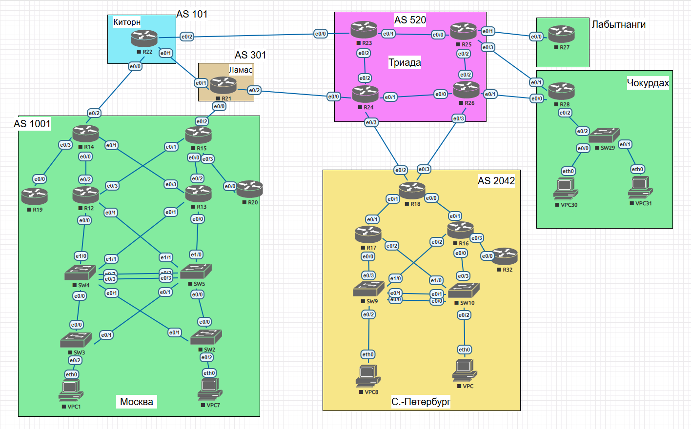

# Лабораторная работа. Проектирование сети

## Топология

### Задание

1. Разработать и задокументировать адресное пространство;
2. Настроить IP адреса на каждом активном порту;
3. Настроить каждый VPC в каждом офисе в своем VLAN;
4. Настроить VLAN/Loopbackup interface управления для сетевых устройств;
5. Настроите сети офисов так, чтобы не возникало broadcast штормов, а использование линков было максимально оптимизировано;
6. Использовать IPv4;
7. Задокументировать все изменения.

### Решение

*Файл *.zip [here](export-20241115-181128.zip)*

### 1. Задокументируем используемое адресное пространство с использованием IPv4

Список VLAN

| № VLAN        | VLAN name     |  Примечание                   |
|---------------|---------------|-------------------------------|
|1              |   default     | Не используется               |
|8              |   Management  | Для управления устройствами   |
|10-90          |   VPC         | Для VPC                       |
|91-99          |   Reserve     | Зарезервировано               |

Общая таблица сетей:

| Адрес сети IPv4   | Примечание    | VLAN     |
|------------------:|:-------------:|----------|
| 172.16.0.0/20     | Москва        | 8,10-11  |
| 172.16.16.0/24    | Триада        |          |
| 172.16.20.0/22    | С.-Петербург  | 8,20-21  |
| 172.16.30.0/24    | Чокурдах      | 8,30-31  |
| 172.16.40.0/24    | Киторн        |          |
| 172.16.50.0/24    | Лабытнаги     |          |
| 172.16.60.0/24    | Ламас         |          |
| 172.16.70.0/24    | Стыки между узлами|      |

### 2.Задокументируем выделенные для маршрутизаторов IP-адреса

Общая таблица сетевых адресов на интерфейсах оборудования и соответствие VLAN.

| IPv4 адрес    | Примечание    | VLAN     |
|--------------:|:--------------|----------|
|               |  Москва       |          |
| 172.16.0.0/24 | Сеть VPC10    | 10       |
| 172.16.0.1    | Шлюз          |          |
| 172.16.0.2    | R12 e0/0      |          |
| 172.16.0.3    | R12 e0/1      |          |
| 172.16.0.4    | R13 e0/0      |          |
| 172.16.0.5    | R13 e0/1      |          |
| 172.16.0.6    | VPC10         |          |
|               |               |          |
| 172.16.1.0/24 | Сеть VPC11    | 11       |
| 172.16.1.1    | Шлюз          |          |
| 172.16.1.2    | R12 e0/0      |          |
| 172.16.1.3    | R12 e0/1      |          |
| 172.16.1.4    | R13 e0/0      |          |
| 172.16.1.5    | R13 e0/1      |          |
| 172.16.1.6    | VPC11         |          |
|               |               |          |
| 172.16.4.0/24 | Management    | 8        |
| 172.16.4.1    | Шлюз          |          |
| 172.16.4.2    | SW2           |          |
| 172.16.4.3    | SW3           |          |
| 172.16.4.4    | SW4           |          |
| 172.16.4.5    | SW5           |          |
| 172.16.4.6    | R12           |          |
| 172.16.4.6    | R13           |          |
| 172.16.4.6    | R14           |          |
| 172.16.4.6    | R15           |          |
| 172.16.4.6    | R19           |          |
| 172.16.4.6    | R20           |          |
|               |               |          |
| 172.16.5.0/24 | Стыки между маршрутизаторами| -   |
| 172.16.5.1    | R19 e0/0      |          |
| 172.16.5.2    | R14 e0/3      |          |
| 172.16.5.5    | R14 e0/0      |          |
| 172.16.5.6    | R12 e0/2      |          |
| 172.16.5.9    | R14 e0/1      |          |
| 172.16.5.10   | R13 e0/3      |          |
| 172.16.5.13   | R15 e0/1      |          |
| 172.16.5.14   | R12 e0/3      |          |
| 172.16.5.17   | R15 e0/0      |          |
| 172.16.5.18   | R13 e0/2      |          |
| 172.16.5.21   | R15 e0/3      |          |
| 172.16.5.22   | R20 e0/0      |          |
|               |               |          |
|               |  Триада       |          |
| 172.16.16.0/24| Стыки между маршрутизаторами| -   |
| 172.16.16.1   | R23 e0/1      |          |
| 172.16.16.2   | R25 e0/0      |          |
| 172.16.16.5   | R25 e0/2      |          |
| 172.16.16.6   | R26 e0/2      |          |
| 172.16.16.9   | R26 e0/0      |          |
| 172.16.16.10  | R24 e0/1      |          |
| 172.16.16.13  | R24 e0/2      |          |
| 172.16.16.14  | R23 e0/2      |          |
|               |               |          |
|               | С.-Петербург  |          |
| 172.16.20.0/24| Сеть VPC20    | 20       |
| 172.16.20.1   | Шлюз          |          |
| 172.16.20.2   | R17 e0/0      |          |
| 172.16.20.3   | R17 e0/2      |          |
| 172.16.20.4   | R16 e0/0      |          |
| 172.16.20.5   | R16 e0/2      |          |
| 172.16.20.6   | VPC20         |          |
|               |               |          |
| 172.16.21.0/24| Сеть VPC21    | 21       |
| 172.16.21.1   | Шлюз          |          |
| 172.16.21.2   | R17 e0/0      |          |
| 172.16.21.3   | R17 e0/2      |          |
| 172.16.21.4   | R16 e0/0      |          |
| 172.16.21.5   | R16 e0/2      |          |
| 172.16.21.6   | VPC21         |          |
|               |               |          |
| 172.16.22.0/24| Management    | 8        |
| 172.16.22.1   | Шлюз          |          |
| 172.16.22.2   | R16           |          |
| 172.16.22.3   | R17           |          |
| 172.16.22.4   | R18           |          |
| 172.16.22.5   | R32           |          |
| 172.16.22.6   | SW9           |          |
| 172.16.22.7   | SW10          |          |
|               |               |          |
| 172.16.23.0/24| Стыки между маршрутизаторами| -   |
| 172.16.23.1   | R18 e0/1      |          |
| 172.16.23.2   | R17 e0/1      |          |
| 172.16.23.5   | R18 e0/0      |          |
| 172.16.23.6   | R16 e0/1      |          |
| 172.16.23.9   | R16 e0/3      |          |
| 172.16.23.10  | R32 e0/0      |          |
|               |               |          |
|               | Чокурдах      |          |
| 172.16.30.0/28| Сеть VPC30    | 30       |
| 172.16.30.1   | Шлюз (R28 e0/0)          |          |
| 172.16.30.2   | VPC30         |          |
|               |               |          |
|172.16.30.16/28| Сеть VPC31    | 31       |
| 172.16.30.17  | Шлюз (R28 e0/0)          |          |
| 172.16.30.18  | VPC31         |          |
|               |               |          |
|172.16.30.32/28| Management    | 8        |
| 172.16.30.33  | Шлюз          |          |
| 172.16.30.34  | R28           |          |
| 172.16.30.35  | SW29          |          |
|               |               |          |
|172.16.70.0/24 | Стыки между узлами|      |
| 172.16.70.1   | R22 e0/0      |          |
| 172.16.70.2   | R14 e0/2      |          |
| 172.16.70.5   | R22 e0/1      |          |
| 172.16.70.6   | R21 e0/1      |          |
| 172.16.70.9   | R22 e0/2      |          |
| 172.16.70.10  | R23 e0/0      |          |
| 172.16.70.13  | R21 e0/0      |          |
| 172.16.70.14  | R15 e0/2      |          |
| 172.16.70.17  | R21 e0/2      |          |
| 172.16.70.18  | R24 e0/0      |          |
| 172.16.70.21  | R24 e0/3      |          |
| 172.16.70.22  | R18 e0/2      |          |
| 172.16.70.25  | R26 e0/3      |          |
| 172.16.70.26  | R18 e0/3      |          |
| 172.16.70.29  | R25 e0/1      |          |
| 172.16.70.30  | R27 e0/0      |          |
| 172.16.70.33  | R25 e0/3      |          |
| 172.16.70.34  | R28 e0/1      |          |
| 172.16.70.37  | R26 e0/1      |          |
| 172.16.70.38  | R28 e0/0      |          |

### 3.Настроим IP-адреса с учетом приведённой выше схемы и задокументируем изменения

Изменения на маршрутизаторах сводятся к:

1. Назначению адресов ipv4 на интерфейсах;
2. Включению самих интерфейсов (физические интерфейсы по-умолчанию выключены).

Настраивать буду постепенно, согласно следующим ДЗ. Так что в первую очередь пропишу адреса на узлах офисов **Лабытнанги** и **Чокурдах**.

Для упрощения создал файл с базовыми настройками устройств:

    conf terminal 
    line console 0 
    logging synchronous 
    password cisco
    login
    exit
    no ip domain-lookup
    hostname R-27
    enable secret class
    service password-encryption
    line vty 0 4
    password cisco
    login
    exit
    end
    wr

Далее приступил к "тонкой" настройке. Начал с **SW29**:

    SW-29(config)#interface e0/1
    SW-29(config-if)#switchport mode access
    SW-29(config-if)#switchport access vlan 31
        % Access VLAN does not exist. Creating vlan 31
    SW-29(config-if)#exit
    SW-29(config)#int e0/0
    SW-29(config-if)#sw mo ac
    SW-29(config-if)#sw ac vl 30
        % Access VLAN does not exist. Creating vlan 30
    SW-29(config)#int e 0/2
    SW-29(config-if)#switchport trunk encapsulation dot1q
    SW-29(config-if)#sw mo tr
    SW-29(config-if)#sw tr all vl 8,30,31
    SW-29(config-if)#ex
    SW-29(config)#vl 8
    SW-29(config-vlan)#name MNGMNT
    SW-29(config-vlan)#vlan 30
    SW-29(config-vlan)#name VPC30 netw
    SW-29(config-vlan)#vlan 31
    SW-29(config-vlan)#name VPC31 netw
    SW-29(config-vlan)#ex
    SW-29(config)#interface vlan 8
    SW-29(config-if)#ip address 172.16.30.35 255.255.255.240
    SW-29(config-if)#no shutdown
    SW-29(config)#ip default-gateway 172.16.30.33

Настроил **VPC30** и **VPC31**:

    VPCS> ip 172.16.30.2/28 172.16.30.1
    Checking for duplicate address...
    VPCS : 172.16.30.2 255.255.255.240 gateway 172.16.30.1

    VPCS> ip 172.16.30.18/28 172.16.30.17
    Checking for duplicate address...
    VPCS : 172.16.30.18 255.255.255.240 gateway 172.16.30.17

На сладкое **R28**:

    R-28(config)#int e0/2.8
    R-28(config-subif)#encapsulation dot1Q 8
    R-28(config-subif)#ip address 172.16.30.33 255.255.255.240
    R-28(config-subif)#description MNGMNT
    R-28(config-subif)#
    R-28(config-subif)#int e0/2.30
    R-28(config-subif)#encapsulation dot1Q 30
    R-28(config-subif)#ip address 172.16.30.1 255.255.255.240
    R-28(config-subif)#description VPC30_netw
    R-28(config-subif)#
    R-28(config-subif)#int e0/2.31
    R-28(config-subif)#encapsulation dot1Q 31
    R-28(config-subif)#ip address 172.16.30.17 255.255.255.240
    R-28(config-subif)#description VPC31_netw
    R-28(config)#interface e0/0
    R-28(config-if)#ip address 172.16.70.38 255.255.255.252
    R-28(config-if)#int e0/1
    R-28(config-if)#ip address 172.16.70.34 255.255.255.252

И не забыл **R27**:

    R-27#conf t
    R-27(config)#int e 0/0
    R-27(config-if)#ip address 172.16.70.30 255.255.255.252
    R-27(config-if)#no shutdown

Пара тестов:

    VPCS> ping 172.16.30.1

    84 bytes from 172.16.30.1 icmp_seq=1 ttl=255 time=1.301 ms
    84 bytes from 172.16.30.1 icmp_seq=2 ttl=255 time=1.434 ms
    84 bytes from 172.16.30.1 icmp_seq=3 ttl=255 time=1.756 ms
    84 bytes from 172.16.30.1 icmp_seq=4 ttl=255 time=1.838 ms

    VPCS> ping 172.16.30.18

    84 bytes from 172.16.30.18 icmp_seq=1 ttl=63 time=3.048 ms
    84 bytes from 172.16.30.18 icmp_seq=2 ttl=63 time=3.111 ms
    84 bytes from 172.16.30.18 icmp_seq=3 ttl=63 time=2.811 ms

    SW-29#ping 172.16.30.33
    Type escape sequence to abort.
    Sending 5, 100-byte ICMP Echos to 172.16.30.33, timeout is 2 seconds:
    !!!!!
    Success rate is 100 percent (5/5), round-trip min/avg/max = 1/1/1 ms
